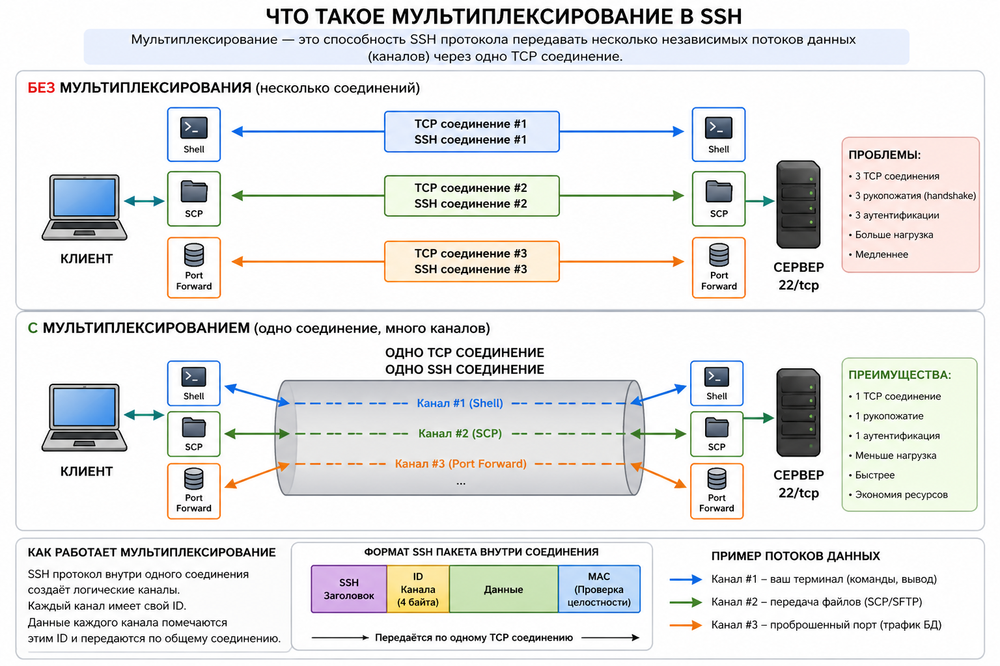

# SSH — Secure Shell
> Углублённая лекция · DevOps Middle+

---

## Содержание

1. [Как SSH работает изнутри](#1-как-ssh-работает-изнутри)
2. [Аутентификация по ключу — механизм](#2-аутентификация-по-ключу)
3. [Генерация ключей — алгоритмы и выбор](#3-генерация-ключей)
4. [sshd\_config — настройка и hardening сервера](#4-sshd_config)
5. [~/.ssh/config — управление подключениями](#5-sshconfig)
6. [authorized\_keys — опции и тонкости](#6-authorized_keys)
7. [ssh-agent — зачем и как правильно](#7-ssh-agent)
8. [SSH туннели](#8-ssh-туннели)
9. [ProxyJump и бастион-хосты](#9-proxyjump-и-бастион-хосты)
10. [Certificate-based SSH](#10-certificate-based-ssh)
11. [Практические фишки](#11-практические-фишки)
12. [Типовые кейсы с собесов](#12-типовые-кейсы-с-собесов)
13. [Вопросы на собесе](#13-вопросы-на-собесе)
14. [Шпаргалка](#14-шпаргалка)

---

## 1. Как SSH работает изнутри

### Зачем понимать протокол

На собесе Middle часто спрашивают не «как подключиться», а «что происходит когда ты пишешь `ssh user@host`». Без понимания протокола невозможно объяснить почему что-то не работает.

### SSH — три слоя протокола

SSH состоит из трёх независимых протоколов, уложенных друг в друга:

```
┌─────────────────────────────────────────────────┐
│  SSH Connection Protocol         ← СЛОЙ 3       │
│  Мультиплексирует каналы: shell, туннели, scp   │
├─────────────────────────────────────────────────┤
│  SSH User Authentication Protocol ← СЛОЙ 2      │
│  Проверяет кто ты: ключ, пароль, GSSAPI        │
├─────────────────────────────────────────────────┤
│  SSH Transport Layer Protocol    ← СЛОЙ 1       │
│  Шифрование, MAC, сжатие, обмен ключами        │
└─────────────────────────────────────────────────┘
          поверх TCP (порт 22)
```

**Мультиплексирование** — чтобы понять зачем это нужно, сначала разберёмся что вообще такое TCP соединение в контексте SSH.

Когда вы пишете `ssh user@server` — между вашим компьютером и сервером устанавливается одно TCP соединение. TCP это как телефонный звонок: линия открыта, по ней идут байты туда и обратно. Сам TCP не знает ничего про SSH, shell, файлы — он просто передаёт поток байт.

**Проблема:** вы зашли на сервер по SSH и одновременно хотите пробросить порт (`-L 5432:db:5432`) чтобы подключиться к базе данных. Это два разных потока данных. Без мультиплексирования SSH создал бы второе отдельное TCP соединение — второй «звонок» с отдельной аутентификацией.

**Что делает мультиплексирование:** SSH берёт одно TCP соединение и внутри него создаёт несколько нумерованных каналов. Каждый пакет данных помечается номером своего канала. Получатель читает номер и передаёт данные нужному получателю:

```
Одно TCP соединение к серверу
│
├── Канал №0 — ваш shell (команды, вывод)
├── Канал №1 — туннель :5432 → db:5432 (трафик PostgreSQL)
└── Канал №2 — scp передача файла

Всё это одновременно, через одно подключение.
```



Практический пример — что происходит реально:

```bash
# Открываете SSH с пробросом порта к db.internal через сервер-посредник
ssh -L 5432:db.internal:5432 user@bastion

# Теперь у вас:
# — shell сессия на бастионе              (канал 0)
# — проброс порта для psql               (канал 1)

# В другом терминале подключаетесь к БД
psql -h localhost -p 5432 mydb
# psql → ваш localhost:5432 → SSH канал 1 → bastion → db.internal:5432
# Всё через то же самое TCP соединение что и ваш shell
```

Здесь важно не запутаться: `localhost` в команде `psql` — это **ваша** машина, порт 5432 на которой открыл SSH туннель. `db.internal:5432` — это конечный сервер куда bastion перенаправляет трафик. Вы подключаетесь к своему localhost, SSH сам доставляет трафик до db.internal. Если хотите подключиться к БД которая запущена прямо на том же сервере куда заходите по SSH — тогда уже пишете `localhost` в обоих местах:

```bash
ssh -L 5432:localhost:5432 user@db-server
# localhost здесь означает: сервер db-server сам к себе
psql -h localhost -p 5432 mydb
# ваш localhost:5432 → SSH туннель → db-server:5432 (сервер к себе)
```

Если настроен `ControlMaster` — то даже новый `ssh` или `scp` в другом терминале не открывают новое TCP соединение, а добавляют ещё один канал в уже существующее. Отсюда мгновенное подключение без повторной аутентификации.

> 📌 **ControlMaster** разобран подробно в [разделе 5 — ~/.ssh/config](#5-sshconfig): там объяснена разница между мультиплексированием каналов внутри одного SSH и переиспользованием TCP соединения между разными терминалами, а также как это настроить.

**GSSAPI (Generic Security Services API)** — стандартный интерфейс для подключения внешних систем аутентификации. В SSH используется почти исключительно для **Kerberos** — протокола аутентификации который применяется в корпоративных сетях с Active Directory. Смысл: вы уже авторизованы в домене Windows/AD, и SSH использует этот тикет вместо пароля или ключа. Если вы работаете не в корпоративной среде с AD — GSSAPI вам не встретится. Именно поэтому `GSSAPIAuthentication no` ускоряет подключение к обычным серверам — SSH не тратит время на попытку Kerberos аутентификации.

**MAC (Message Authentication Code)** — код аутентификации сообщения. Это короткая контрольная сумма которая вычисляется и прикладывается к каждому пакету. Если пакет был изменён в пути — MAC не совпадёт и соединение разрывается. MAC обеспечивает **целостность** данных: гарантирует что то что вы получили — именно то что отправили, без изменений. Шифрование скрывает содержимое, MAC проверяет что содержимое не подменили.

### Handshake — что происходит при подключении

Схема ниже — это детальное раскрытие тех же трёх слоёв применительно к реальному подключению. Шаги 1–4 это Слой 1 (Transport), шаг 5 это Слой 2 (Authentication), шаг 6 это Слой 3 (Connection):

```
Клиент                                    Сервер
  │                                         │
  │──── TCP SYN ───────────────────────────►│
  │◄─── TCP SYN-ACK ───────────────────────│
  │                                         │
  │ ╔══ СЛОЙ 1: Transport Layer ══════════╗ │
  │ ║                                     ║ │
  │ ║ 1. ОБМЕН ВЕРСИЯМИ                   ║ │
  │ ║──── SSH-2.0-OpenSSH_9.0 ───────────►║ │
  │ ║◄─── SSH-2.0-OpenSSH_8.9 ───────────║ │
  │ ║                                     ║ │
  │ ║ 2. СОГЛАСОВАНИЕ АЛГОРИТМОВ          ║ │
  │ ║   - алгоритм обмена ключами (ECDH)  ║ │
  │ ║   - шифр канала (AES-256-GCM)       ║ │
  │ ║   - MAC алгоритм (HMAC-SHA2)        ║ │
  │ ║                                     ║ │
  │ ║ 3. ОБМЕН КЛЮЧАМИ (ECDH)             ║ │
  │ ║   Вычисляют общий секрет            ║ │
  │ ║   не передавая его по сети          ║ │
  │ ║                                     ║ │
  │ ║ 4. ПРОВЕРКА ХОСТА                   ║ │
  │ ║◄─── Host Public Key ───────────────║ │
  │ ║   Клиент сверяет с known_hosts     ║ │
  │ ║   [Всё что дальше — зашифровано]   ║ │
  │ ╚═════════════════════════════════════╝ │
  │                                         │
  │ ╔══ СЛОЙ 2: Authentication ═══════════╗ │
  │ ║ 5. АУТЕНТИФИКАЦИЯ ПОЛЬЗОВАТЕЛЯ     ║ │
  │ ║   - по ключу (publickey)            ║ │
  │ ║   - по паролю (password)            ║ │
  │ ║   - по сертификату                  ║ │
  │ ╚═════════════════════════════════════╝ │
  │                                         │
  │ ╔══ СЛОЙ 3: Connection ═══════════════╗ │
  │ ║ 6. ОТКРЫТИЕ КАНАЛА                  ║ │
  │ ║   shell / exec / sftp / tunnel      ║ │
  │ ╚═════════════════════════════════════╝ │
```

### Проверка хоста — known_hosts

**`~/.ssh/known_hosts`** — файл на вашей машине в котором SSH клиент хранит публичные ключи всех серверов к которым вы когда-либо подключались. Он нужен чтобы при каждом подключении SSH мог убедиться: этот сервер тот же самый что и в прошлый раз, а не кто-то посторонний который притворяется им.

Первый раз подключаясь к серверу клиент спрашивает:

```
The authenticity of host '1.2.3.4' can't be established.
ED25519 key fingerprint is SHA256:abc123...
Are you sure you want to continue connecting (yes/no)?
```

Это не просто предупреждение — это защита от **MITM (Man-in-the-Middle)** атаки. Если ответить `yes`, отпечаток сохраняется в `~/.ssh/known_hosts`. При следующем подключении SSH проверяет что ключ сервера совпадает с сохранённым.

Формат записи в `known_hosts` — три поля: адрес хоста, алгоритм, публичный ключ сервера:

```
1.2.3.4 ecdsa-sha2-nistp256 AAAAE2VjZHNh...
[1.2.3.4]:2222 ssh-ed25519 AAAAC3NzaC1...
```

Но вы можете увидеть у себя совсем другое — вот так:

```
|1|ENbwEArKPL7amzivTKYDEXjF9Zw=|ODvMzngRAOFSWYT5Eb/H3fdC49c= ssh-ed25519 AAAAC3NzaC1...
```

Это **хэшированный формат** — адрес хоста скрыт. Разбор структуры:

```
|1| ENbwEArKPL7...= | ODvMzng...= ssh-ed25519 AAAA...
 │       │                │
 │       │                └── HMAC-SHA1(соль + hostname) — хэш адреса
 │       └── соль (случайные байты в base64)
 └── версия формата (1 = HMAC-SHA1)
```

Включается настройкой `HashKnownHosts yes` в `/etc/ssh/ssh_config` или `~/.ssh/config`. На Debian/Ubuntu эта опция включена по умолчанию — именно поэтому вы видите такие записи.

**Зачем хэшировать адреса?** Если кто-то получит доступ к вашему `known_hosts` — он не узнает к каким серверам вы подключались. Это privacy мера: список хостов сам по себе может быть чувствительной информацией (адреса продакшн серверов, внутренние хосты компании).

**Важно:** `ssh-keygen -R hostname` умеет работать с хэшированным форматом — он сам вычислит нужный хэш и найдёт запись для удаления. Вам не нужно вручную расшифровывать. При подключении SSH тоже всё делает автоматически — хэширует адрес и ищет в файле.

**Команды которые реально используются в работе:**

```bash
# Удалить устаревшую запись — нужно после каждого пересоздания сервера
# (новый сервер = новые ключи хоста = SSH ругается на несоответствие)
ssh-keygen -R 1.2.3.4
ssh-keygen -R "[1.2.3.4]:2222"    # если нестандартный порт

# Добавить ключ сервера заранее без интерактивного вопроса
# Нужно в скриптах автоматизации и CI/CD — чтобы ssh не зависал
# ожидая ввода "yes/no" при первом подключении
ssh-keyscan -t ed25519 1.2.3.4 >> ~/.ssh/known_hosts

# Проверить отпечаток ключа сервера вручную
# Нужно когда подключаетесь к новому серверу и хотите сверить
# отпечаток с тем что показывает облачная консоль (AWS, GCP...)
# перед тем как ответить "yes"
ssh-keyscan -t ed25519 1.2.3.4 2>/dev/null | ssh-keygen -lf -
# 256 SHA256:abc123... 1.2.3.4 (ED25519)
```

Самая частая ситуация — `ssh-keygen -R`: пересоздали сервер в облаке, при подключении SSH ругается `REMOTE HOST IDENTIFICATION HAS CHANGED`, вы точно знаете что это ваш новый сервер — удаляете старую запись и подключаетесь снова.

Когда ключ сервера меняется — SSH кричит:

```
@@@@@@@@@@@@@@@@@@@@@@@@@@@@@@@@@@@@@@@@@@@@@@@
@ WARNING: REMOTE HOST IDENTIFICATION HAS CHANGED! @
@@@@@@@@@@@@@@@@@@@@@@@@@@@@@@@@@@@@@@@@@@@@@@@
```

Это может означать:
- Сервер был пересоздан (нормально, удали старую запись)
- Кто-то проводит MITM атаку (плохо, разбираться)

---

## 2. Аутентификация по ключу

### Асимметричная криптография в двух словах

SSH использует пару ключей:
- **Приватный ключ** — секрет, хранится у вас. Никогда никому не передаётся.
- **Публичный ключ** — можно раздавать всем. Кладётся на серверы.

Математика устроена так: то что зашифровано публичным ключом — расшифровывается только приватным. И наоборот: то что подписано приватным ключом — проверяется публичным.

### Как именно происходит аутентификация по ключу

Многие думают что клиент «отправляет ключ» серверу. Это не так — приватный ключ никогда не покидает клиента:

```
Клиент                                    Сервер
  │                                         │
  │──── "хочу войти как alice" ────────────►│
  │◄─── "докажи что ты alice" ─────────────│
  │     (случайный challenge — nonce)       │
  │                                         │
  │  Клиент подписывает challenge           │
  │  своим ПРИВАТНЫМ ключом                 │
  │                                         │
  │──── подпись(challenge) ────────────────►│
  │                                         │
  │     Сервер проверяет подпись            │
  │     публичным ключом из                 │
  │     ~/.ssh/authorized_keys              │
  │     Подпись валидна? → пускаем          │
  │◄─── OK ────────────────────────────────│
```

**Что такое nonce (challenge)?**

**Nonce (number used once)** — случайное число которое сервер генерирует заново для каждой попытки аутентификации. Сервер никогда не повторяет одно и то же число дважды.

Зачем это нужно: без nonce атакующий мог бы записать вашу подпись один раз и воспроизводить её снова и снова (replay attack). С nonce — подпись сделана для конкретного случайного числа которое существует одну сессию. Если записать и переиспользовать — сервер сгенерирует другой nonce и ваша старая подпись не подойдёт.

Приватный ключ никуда не уходит. Сервер никогда его не видит. Именно поэтому аутентификация по ключу безопаснее пароля — нечего перехватывать.

### Копирование публичного ключа на сервер

Чтобы сервер мог аутентифицировать вас по ключу, ваш **публичный** ключ должен находиться на сервере в файле `~/.ssh/authorized_keys` (в домашней директории того пользователя, под которым вы логинитесь). Именно этот файл sshd читает во время аутентификации и ищет в нём ваш ключ.

`ssh-copy-id` автоматизирует этот процесс: подключается к серверу по паролю и дописывает ваш публичный ключ в `~/.ssh/authorized_keys` на удалённой стороне. Если директории `~/.ssh` или файла `authorized_keys` ещё нет — создаёт их с правильными правами (`700` и `600` соответственно).

```bash
# правильный способ — ssh-copy-id
ssh-copy-id -i ~/.ssh/id_ed25519.pub user@server
# добавляет ключ в ~/.ssh/authorized_keys на сервере
# создаёт директорию и файл с правильными правами если нет

# на нестандартном порту
ssh-copy-id -i ~/.ssh/id_ed25519.pub -p 2222 user@server

# вручную если ssh-copy-id недоступен
cat ~/.ssh/id_ed25519.pub | ssh user@server 'mkdir -p ~/.ssh && cat >> ~/.ssh/authorized_keys && chmod 600 ~/.ssh/authorized_keys && chmod 700 ~/.ssh'

# или через pipe
ssh user@server 'cat >> ~/.ssh/authorized_keys' < ~/.ssh/id_ed25519.pub
```

---

## 3. Генерация ключей

### Алгоритмы — что выбрать

| Алгоритм | Команда | Безопасность | Когда использовать |
|---------|---------|-------------|-------------------|
| **Ed25519** | `-t ed25519` | ✅ Лучший выбор | Всегда — если нет особых ограничений |
| **ECDSA** | `-t ecdsa -b 521` | ✅ Хорошо | Когда инфраструктура требует ECDSA |
| **RSA 4096** | `-t rsa -b 4096` | ⚠️ Устаревает | Совместимость со старым ПО |
| **RSA 2048** | `-t rsa -b 2048` | ⚠️ Минимум | Только если Ed25519 нельзя |
| **DSA** | `-t dsa` | ❌ Сломан | Никогда |

На практике в 2024+ году используется **Ed25519 по умолчанию**. RSA оставляют только ради совместимости с очень старым оборудованием или ПО (некоторые сетевые устройства, старые версии OpenSSH).

### Best practice — давать ключу осмысленное имя

Если не указать флаг `-f`, `ssh-keygen` сохранит ключ в `~/.ssh/id_ed25519`. Это нормально если ключ один. Но как только нужен второй ключ — без явного имени он **перезапишет** первый:

```bash
# ❌ Опасно если уже есть ключ
ssh-keygen -t ed25519 -C "github"
# Saving key to /home/user/.ssh/id_ed25519
# Overwrite (y/n)?   ← предупредит, но легко случайно нажать y
```

Правильный подход — всегда указывать имя файла через `-f`:

```bash
# ✅ Каждый ключ имеет своё имя — понятно для чего и ничего не перезапишется
ssh-keygen -t ed25519 -f ~/.ssh/id_github  -C "github"
ssh-keygen -t ed25519 -f ~/.ssh/id_work    -C "work-servers"
ssh-keygen -t ed25519 -f ~/.ssh/id_prod    -C "production"
ssh-keygen -t ed25519 -f ~/.ssh/id_client  -C "client-acme"

# В ~/.ssh/ появится:
# id_github      id_github.pub
# id_work        id_work.pub
# id_prod        id_prod.pub
```

Комментарий (`-C`) не влияет на безопасность — это просто метка в публичном ключе которая помогает понять чей это ключ когда смотришь `authorized_keys` на сервере.

```bash
# RSA если нужна совместимость со старым ПО
ssh-keygen -t rsa -b 4096 -f ~/.ssh/id_legacy -C "legacy-server"

# посмотреть отпечаток ключа
ssh-keygen -lf ~/.ssh/id_github.pub
# 256 SHA256:abc123... github (ED25519)

# посмотреть публичный ключ (чтобы скопировать на сервер)
cat ~/.ssh/id_github.pub
```

### Passphrase — нужен ли

Passphrase — пароль который шифрует приватный ключ на диске. Если кто-то украдёт файл ключа без passphrase — он сможет использовать его немедленно.

```bash
# добавить passphrase к существующему ключу
ssh-keygen -p -f ~/.ssh/id_ed25519

# сменить passphrase
ssh-keygen -p -f ~/.ssh/id_ed25519

# убрать passphrase (если мешает в автоматизации)
ssh-keygen -p -P "старый_пасфраз" -N "" -f ~/.ssh/id_ed25519
```

Для production серверов — passphrase обязателен. Для CI/CD ключей — часто без passphrase, но с жёсткими ограничениями в `authorized_keys`.

### Права на файлы ключей

SSH очень строг к правам — откажется работать если права слишком открытые:

```bash
# правильные права
chmod 700 ~/.ssh
chmod 600 ~/.ssh/id_ed25519        # приватный ключ — только владелец
chmod 644 ~/.ssh/id_ed25519.pub    # публичный — можно читать всем
chmod 600 ~/.ssh/authorized_keys
chmod 600 ~/.ssh/config
chmod 644 ~/.ssh/known_hosts

# типичная ошибка
# Permissions 0644 for '/home/user/.ssh/id_ed25519' are too open.
# → исправить: chmod 600 ~/.ssh/id_ed25519
```

---

## 4. sshd_config

### Что такое sshd и зачем нужен конфиг

**sshd (SSH Daemon)** — это серверная часть SSH. Это фоновый процесс который постоянно работает на сервере, слушает входящие подключения на порту 22 и управляет аутентификацией.

Разделение ролей:
- **ssh** — клиент. Программа которую запускаете вы на своей машине.
- **sshd** — сервер. Демон который работает на удалённом хосте и принимает подключения.

`/etc/ssh/sshd_config` — конфигурационный файл серверной части. Он определяет: на каком порту слушать, кого пускать, как проверять, что разрешено делать после входа. Это главный инструмент для hardening — ужесточения безопасности SSH сервера.

Клиентская конфигурация (то как подключаетесь вы) — это отдельный файл `~/.ssh/config` который рассматривается в разделе 5.

### Где находится и как применять изменения

```bash
/etc/ssh/sshd_config          # основной конфиг
/etc/ssh/sshd_config.d/*.conf # дополнительные файлы (современный подход)

# проверить синтаксис ПЕРЕД применением
sshd -t                       # только проверка, не запускать
sshd -T                       # показать итоговую конфигурацию со всеми дефолтами

# применить изменения
systemctl reload sshd          # graceful reload (активные соединения не рвутся)
# НЕ systemctl restart sshd — это оборвёт все текущие сессии!
```

> ⚠️ **Критически важно:** всегда держать открытую сессию пока проверяете изменения sshd. Если сломаете конфиг и применить reload — потеряете доступ. Используйте отдельный терминал для проверки.

### Production hardening — минимальный необходимый набор

```bash
# /etc/ssh/sshd_config

# ── ПОРТ ──────────────────────────────────────────────────────────
Port 22
# Смена порта не является security мерой (security through obscurity).
# Реальная польза: уменьшение шума в логах от ботов.
# На серверах с публичным IP — часто меняют на нестандартный.

# ── ДОСТУП ────────────────────────────────────────────────────────
PermitRootLogin no
# Никогда не разрешать прямой root логин.
# Вариант: PermitRootLogin prohibit-password
# (разрешить только по ключу, но не по паролю — для автоматизации)

PasswordAuthentication no
# Отключить аутентификацию по паролю — только ключи.
# Самая важная настройка для безопасности.

PubkeyAuthentication yes
# Убедиться что аутентификация по ключу включена (дефолт yes).

# ── ОГРАНИЧЕНИЕ ДОСТУПА ───────────────────────────────────────────
AllowUsers alice bob deploy
# Белый список пользователей. Все остальные — отказ.

AllowGroups sshusers developers
# Или по группам. AllowUsers и AllowGroups работают совместно через AND.

# Запретить конкретных пользователей
DenyUsers guest test

# Ограничить по IP (через Match)
Match Address 10.0.0.0/8
    AllowUsers admin

# ── ТАЙМАУТЫ И ПОДКЛЮЧЕНИЯ ────────────────────────────────────────
LoginGraceTime 30
# Время на аутентификацию с момента подключения (в секундах).
# Дефолт 120 — слишком много для ботов.

MaxAuthTries 3
# Максимум попыток аутентификации за одно соединение.
# После превышения — соединение разрывается.

MaxSessions 10
# Максимум сессий на одно соединение (мультиплексирование).

MaxStartups 10:30:100
# Защита от flood: 10 одновременных неаутентифицированных подключений,
# начиная с 30% вероятность отказа, полный отказ при 100.

ClientAliveInterval 300
ClientAliveCountMax 2
# Отправлять keepalive каждые 300 сек. Если 2 раза нет ответа — разрыв.
# Итого: 10 минут до разрыва зависшей сессии.

# ── БЕЗОПАСНОСТЬ ──────────────────────────────────────────────────
X11Forwarding no
# Отключить проброс X11 если не нужен.

AllowTcpForwarding no
# Запретить TCP туннели если не нужны.
# Или: AllowTcpForwarding local (только локальные туннели)

GatewayPorts no
# Запретить внешний доступ к портам туннелей.

PermitEmptyPasswords no
# Запретить пустые пароли (дефолт no, но явно).

# ── АЛГОРИТМЫ (современные) ───────────────────────────────────────
KexAlgorithms curve25519-sha256,curve25519-sha256@libssh.org,diffie-hellman-group16-sha512
HostKeyAlgorithms ssh-ed25519,rsa-sha2-512,rsa-sha2-256
Ciphers chacha20-poly1305@openssh.com,aes256-gcm@openssh.com,aes128-gcm@openssh.com
MACs hmac-sha2-256-etm@openssh.com,hmac-sha2-512-etm@openssh.com

# ── ЛОГИРОВАНИЕ ───────────────────────────────────────────────────
LogLevel VERBOSE
# INFO (дефолт) — базовые события
# VERBOSE — fingerprint ключей при подключении (полезно для аудита)
# DEBUG — для диагностики проблем
SyslogFacility AUTH

# ── РАЗНОЕ ────────────────────────────────────────────────────────
UseDNS no
# Не делать обратный DNS lookup при подключении.
# Ускоряет подключение. Включение полезно только для логов с именами хостов.

PrintLastLog yes
# Показывать время последнего входа.

Banner /etc/ssh/banner.txt
# Показать текст перед аутентификацией (legal notice).
```

### Блок Match — гибкие правила

`Match` — это директива в `/etc/ssh/sshd_config` которая позволяет применять разные настройки для разных условий: конкретного пользователя, IP адреса, группы. Всё что написано внутри блока Match действует только когда условие совпадает, переопределяя глобальные настройки файла:

```bash
# разрешить root по ключу только с IP bastions
Match User root Address 10.10.0.5,10.10.0.6
    PermitRootLogin prohibit-password

# разрешить password auth только из внутренней сети
Match Address 192.168.0.0/16
    PasswordAuthentication yes

# для deploy пользователя — только конкретная команда
Match User deploy
    ForceCommand /usr/local/bin/deploy.sh
    AllowTcpForwarding no
    X11Forwarding no
```

---

## 5. ~/.ssh/config

### Что такое клиентский конфиг

**`~/.ssh/config`** — конфигурационный файл SSH **клиента** на вашей машине. Не путать с `/etc/ssh/sshd_config` — тот настраивает сервер который принимает подключения. Этот файл настраивает то как вы подключаетесь к серверам: какие ключи использовать, через какой хост прыгать, какой порт и пользователь по умолчанию.

Если `sshd_config` — это правила входной двери на сервере, то `~/.ssh/config` — это ваша личная записная книжка с адресами и инструкциями как куда попасть.

### Зачем нужен клиентский конфиг

Без конфига:
```bash
ssh -i ~/.ssh/id_work -p 2222 -l alice -o StrictHostKeyChecking=no -o UserKnownHostsFile=/dev/null myserver.company.com
```

С конфигом:
```bash
ssh myserver
```

`~/.ssh/config` — один из главных инструментов DevOps. Вы тратите на него час один раз и экономите часы каждую неделю.

### Структура и синтаксис

```bash
# ~/.ssh/config

# Правила применяются сверху вниз.
# Первое совпадение имеет приоритет.
# Host * применяется ко всему что не совпало выше.

# ── КОНКРЕТНЫЕ ХОСТЫ ──────────────────────────────────────────────
Host github
    HostName github.com
    User git
    IdentityFile ~/.ssh/id_github
    IdentitiesOnly yes           # использовать ТОЛЬКО этот ключ, не перебирать остальные

Host prod-web
    HostName 10.0.1.10
    User deploy
    Port 2222
    IdentityFile ~/.ssh/id_prod

Host prod-db
    HostName 10.0.1.20
    User postgres
    IdentityFile ~/.ssh/id_prod
    ProxyJump bastion            # подключаться через бастион

Host bastion
    HostName bastion.company.com
    User admin
    IdentityFile ~/.ssh/id_work
    ServerAliveInterval 60

# ── WILDCARD — паттерны ──────────────────────────────────────────
Host *.company.com
    User admin
    IdentityFile ~/.ssh/id_work
    ServerAliveInterval 30
    ServerAliveCountMax 3

Host 10.0.*
    User ubuntu
    IdentityFile ~/.ssh/id_internal
    StrictHostKeyChecking no     # для динамических серверов (осторожно!)
    UserKnownHostsFile /dev/null # не сохранять в known_hosts

# ── ГЛОБАЛЬНЫЕ ДЕФОЛТЫ ────────────────────────────────────────────
Host *
    AddKeysToAgent yes           # автоматически добавлять ключи в ssh-agent
    IdentityFile ~/.ssh/id_ed25519
    ServerAliveInterval 60
    ServerAliveCountMax 3
    Compression yes              # сжатие (полезно на медленных каналах)
    ControlMaster auto           # мультиплексирование соединений
    ControlPath ~/.ssh/cm-%r@%h:%p
    ControlPersist 10m           # держать master соединение 10 минут
```

### ControlMaster — мультиплексирование между терминалами

Прежде чем объяснять ControlMaster — важно разграничить два разных понятия которые легко перепутать.

**Мультиплексирование каналов внутри одного SSH** — это встроенная возможность протокола, работает всегда без какой-либо настройки. Когда вы делаете `ssh -L 3307:localhost:3306 user@server` — внутри одного TCP соединения одновременно работают два канала: shell и туннель для MySQL. Это не ControlMaster, это просто SSH Connection Protocol в действии.

**ControlMaster — это другое.** Он решает другую задачу: переиспользование одного TCP соединения между **разными терминалами и командами**.

```
Без ControlMaster:
──────────────────────────────────────────────────
Терминал 1:  ssh user@server
             └── TCP соединение #1 (handshake + auth)
                 └── канал: shell

Терминал 2:  ssh user@server
             └── TCP соединение #2 (новый handshake + auth)
                 └── канал: shell

Терминал 3:  scp file user@server:/tmp/
             └── TCP соединение #3 (новый handshake + auth)
                 └── канал: scp

Итого: 3 TCP соединения, 3 раза аутентификация

С ControlMaster:
──────────────────────────────────────────────────
Терминал 1:  ssh user@server   ← открыл мастер
             └── TCP соединение #1 (handshake + auth)
                 └── канал: shell

Терминал 2:  ssh user@server   ← мгновенно, без auth
             └── (переиспользует TCP #1)
                 └── новый канал: shell

Терминал 3:  scp file user@server:/tmp/
             └── (переиспользует TCP #1)
                 └── новый канал: scp

Итого: 1 TCP соединение, 1 раз аутентификация
```

ControlMaster делает это через unix-сокет на вашей машине (`~/.ssh/cm-user@server:22`). Первый SSH процесс создаёт этот сокет и становится «мастером». Все последующие подключения к тому же хосту находят сокет и прицепляются к уже существующему TCP каналу.

```bash
# В ~/.ssh/config:
Host *
    ControlMaster auto
    ControlPath ~/.ssh/cm-%r@%h:%p    # путь к unix-сокету
    ControlPersist 10m                # держать мастер 10 мин после закрытия shell

# Первое подключение — обычное, открывает мастер
ssh myserver

# Последующие — мгновенные, без handshake и аутентификации
ssh myserver
scp file myserver:/tmp/

# Посмотреть активные мастер соединения
ls ~/.ssh/cm-*

# Завершить мастер соединение явно
ssh -O exit myserver
```

Практически полезно в деплой скриптах: если скрипт делает 10 последовательных SSH операций на один сервер — без ControlMaster это 10 TCP соединений и 10 аутентификаций, с ControlMaster — одно соединение и всё остальное мгновенно.

---

## 6. authorized_keys

**`~/.ssh/authorized_keys`** — файл на сервере в котором перечислены публичные ключи которым разрешено подключаться к этому аккаунту. Когда вы подключаетесь по ключу — сервер ищет ваш публичный ключ именно здесь. Если нашёл и аутентификация прошла — вы внутри.

Каждая строка файла — один разрешённый публичный ключ. Соотношение простое: один приватный ключ у пользователя, один публичный ключ в `authorized_keys` на каждом сервере куда нужен доступ.

### Опции ключей — тонкое управление доступом

`authorized_keys` — не просто список ключей. Каждый ключ может иметь опции которые ограничивают что с ним можно делать:

```bash
# ~/.ssh/authorized_keys — формат строки:
# [опции] алгоритм base64_ключ комментарий

# Ключ без ограничений (обычный случай)
ssh-ed25519 AAAAC3NzaC... alice@laptop

# ── ОГРАНИЧЕНИЕ КОМАНДЫ ───────────────────────────────────────────
# Этот ключ может выполнить ТОЛЬКО одну команду
command="/usr/local/bin/backup.sh" ssh-ed25519 AAAAC3NzaC... backup-key

# Принудительная команда с передачей оригинального запроса
command="if [ -n \"$SSH_ORIGINAL_COMMAND\" ]; then /usr/local/bin/validate.sh \"$SSH_ORIGINAL_COMMAND\"; fi" ssh-ed25519 AAAAC3...

# ── ОГРАНИЧЕНИЕ ПО IP ─────────────────────────────────────────────
# Разрешить только с определённого IP
from="10.0.0.5" ssh-ed25519 AAAAC3NzaC... deploy-from-ci

# Несколько IP или диапазонов (через запятую)
from="10.0.0.0/8,192.168.1.100" ssh-ed25519 AAAAC3NzaC... restricted-key

# ── ЗАПРЕТЫ ───────────────────────────────────────────────────────
# Запретить всё лишнее для ключей автоматизации
no-port-forwarding,no-X11-forwarding,no-agent-forwarding,no-pty ssh-ed25519 AAAAC3... ci-key

# Запретить только туннели
no-port-forwarding ssh-ed25519 AAAAC3NzaC... limited-key

# ── КОМБИНАЦИИ (реальный пример для CI/CD) ────────────────────────
# Ключ CI системы: только деплой, только с IP CI сервера, без интерактива
from="10.0.0.5",no-port-forwarding,no-X11-forwarding,no-agent-forwarding,no-pty,command="/usr/local/bin/deploy.sh" ssh-ed25519 AAAAC3NzaC... ci-deploy

# ── EXPIRY ────────────────────────────────────────────────────────
# Ключ действует до даты (OpenSSH 8.2+)
expiry-time="20251231" ssh-ed25519 AAAAC3NzaC... temp-contractor-key
```

### Управление authorized_keys в команде

Ручное управление authorized_keys на 100 серверах — ад. Правильные подходы:

```bash
# Ansible (самый распространённый)
- name: Add SSH key for alice
  authorized_key:
    user: alice
    key: "{{ lookup('file', 'keys/alice.pub') }}"
    state: present

# Через Puppet/Chef/Salt — аналогично
# Через SSSD+AD — централизованно, без authorized_keys вообще
```

---

## 7. ssh-agent

### Зачем нужен ssh-agent

Вы правы — `~/.ssh/config` определяет какой ключ использовать для какого хоста. Это работает без всякого агента. Так зачем тогда ssh-agent?

У ssh-agent две задачи, и они независимы:

**Задача 1: не вводить passphrase каждый раз**

Если ключ защищён passphrase — без агента SSH будет спрашивать его при каждом подключении. Агент расшифровывает ключ один раз, держит его в памяти, и при следующих подключениях SSH берёт ключ из агента не беспокоя вас. Если passphrase нет — агент для этой задачи не нужен.

**Задача 2: Agent Forwarding**

Без агента Agent Forwarding (`-A`) невозможен в принципе — пробрасывать нечего. Если нужно с промежуточного сервера подключаться дальше используя ваши локальные ключи — агент обязателен. Но как уже сказано в следующем разделе, ForwardAgent небезопасен и лучше использовать ProxyJump.

```
Ситуация                         Нужен агент?
─────────────────────────────────────────────────────
Ключ без passphrase, нет -A      ❌ Не нужен
Ключ с passphrase                ✅ Удобно — вводите пароль один раз
Agent Forwarding (-A)            ✅ Обязателен
CI/CD с ключом без passphrase    ❌ Не нужен (агент в pipeline создаётся временно)
```

```bash
# запустить агент (если не запущен)
eval "$(ssh-agent -s)"
# Agent pid 12345

# добавить ключ в агент
ssh-add ~/.ssh/id_ed25519
# Enter passphrase: (вводим один раз, дальше не спросит)

# добавить с таймаутом — ключ будет забыт через 4 часа
ssh-add -t 4h ~/.ssh/id_ed25519

# посмотреть что в агенте
ssh-add -l
# 256 SHA256:abc123... /home/user/.ssh/id_ed25519 (ED25519)

# удалить ключ из агента
ssh-add -d ~/.ssh/id_ed25519

# удалить все ключи
ssh-add -D
```

### Автозапуск агента

```bash
# в ~/.bashrc или ~/.zshrc:
if [ -z "$SSH_AUTH_SOCK" ]; then
    eval "$(ssh-agent -s)"
    ssh-add ~/.ssh/id_ed25519 2>/dev/null
fi

# или через ~/.ssh/config — ключ добавляется в агент автоматически при первом использовании
Host *
    AddKeysToAgent yes
```

### Agent Forwarding — проброс агента

**Проблема:** вы на своём ноутбуке → подключились к бастиону → хотите с бастиона подключиться к внутреннему серверу по ключу. Как?

**Решение без ForwardAgent:** скопировать приватный ключ на бастион. Плохо — ключ на чужом сервере.

**Решение с ForwardAgent:** агент на вашем ноутбуке пробрасывается на бастион. С бастиона SSH может использовать ваш локальный агент для аутентификации на внутреннем сервере. Ключ никуда не копируется.

```bash
# временно
ssh -A user@bastion

# в ~/.ssh/config
Host bastion
    ForwardAgent yes
```

> ⚠️ **Риск ForwardAgent:** пока вы подключены к бастиону, root этого бастиона может использовать ваш агент для подключения к любому серверу где ваш ключ авторизован. Никогда не используйте ForwardAgent на ненадёжных хостах.

**Безопасная альтернатива — ProxyJump** (см. раздел 9).

---

## 8. SSH туннели

Туннели — одна из самых часто спрашиваемых тем на собесах. Нужно не просто знать флаги, но и понимать зачем каждый тип.

### Local Port Forwarding (-L) — «пробросить к себе»

Создаёт порт на **вашей** машине, который перенаправляет трафик через SSH на удалённый хост.

```bash
ssh -L [local_bind_addr:]local_port:remote_host:remote_port user@ssh_server

# Примеры:
# Работа с PostgreSQL на удалённом сервере через локальный клиент
ssh -L 5432:localhost:5432 user@db-server
# Теперь: psql -h localhost -p 5432 → соединяется с PostgreSQL на db-server

# Доступ к сервису во внутренней сети через бастион
ssh -L 8080:internal-web.local:80 user@bastion
# Открыть в браузере: http://localhost:8080

# Несколько туннелей одновременно
ssh -L 5432:db:5432 -L 6379:redis:6379 -L 8080:web:80 user@bastion

# Только туннель, без shell
ssh -N -L 5432:localhost:5432 user@db-server
# -N = не выполнять команды, просто держать туннель

# В фоне
ssh -N -f -L 5432:localhost:5432 user@db-server
# -f = уйти в фон перед выполнением команды

# В ~/.ssh/config постоянный туннель
Host db-tunnel
    HostName bastion.company.com
    User alice
    LocalForward 5432 db.internal:5432
    LocalForward 6379 redis.internal:6379
```

```
Вы              SSH сервер (бастион)      Внутренний сервис
localhost:8080 ──────────────────────────► internal-web:80
               ▲ SSH туннель (зашифрован)
               │
               Ваша машина инициирует соединение
```

### Remote Port Forwarding (-R) — «пробросить к ним»

Создаёт порт на **удалённом** сервере, который перенаправляет трафик обратно к вам. Полезно когда удалённый сервер не может достучаться до вас напрямую (NAT, firewall).

```bash
ssh -R [remote_bind_addr:]remote_port:local_host:local_port user@ssh_server

# Пример: дать коллеге временный доступ к вашему локальному сервису
ssh -R 8080:localhost:3000 user@public-server
# Коллега открывает: http://public-server:8080 → попадает на ваш localhost:3000

# Реальный кейс: webhook от GitHub на локальную машину в разработке
ssh -R 80:localhost:3000 user@public-server
# Настраиваем GitHub webhook на http://public-server/
# Запросы приходят на public-server:80 → туннелируются → ваш localhost:3000
```

> ⚠️ Для `-R` с биндом на `0.0.0.0` (доступно извне) нужен `GatewayPorts yes` в sshd_config удалённого сервера. По умолчанию порты биндятся только на localhost.

### Dynamic Port Forwarding (-D) — SOCKS прокси

Создаёт SOCKS5 прокси на вашей машине. Весь трафик через прокси идёт через SSH туннель.

```bash
ssh -D 1080 user@ssh_server
# Теперь настройте браузер/приложение на SOCKS5 прокси localhost:1080
# Весь трафик браузера будет идти через ssh_server

# Без shell
ssh -N -D 1080 user@ssh_server

# Использовать curl через SOCKS прокси
curl --socks5 localhost:1080 http://internal-site.local
```

### Сравнение типов туннелей

```
-L (Local)    Вы пробрасываете УДАЛЁННЫЙ сервис К СЕБЕ
              Кто инициирует: вы
              Где открывается порт: на вашей машине
              Кейс: доступ к БД, внутренним сервисам

-R (Remote)   Вы пробрасываете СВОЙ сервис НА УДАЛЁННЫЙ хост
              Кто инициирует: вы, но трафик идёт обратно
              Где открывается порт: на удалённой машине
              Кейс: webhook разработка, обход NAT

-D (Dynamic)  Создаёт SOCKS прокси
              Кто инициирует: вы
              Где открывается порт: на вашей машине
              Кейс: маршрутизация всего трафика через SSH сервер
```

---

## 9. ProxyJump — подключение через промежуточный хост

### Jump host — что это и зачем

**Jump host (промежуточный хост)** — любой сервер через который вы прыгаете чтобы попасть на другой сервер который недоступен напрямую. Причин может быть несколько:

- Целевой сервер в закрытой сети без публичного IP (самый частый случай)
- Между вами и целевым сервером firewall который закрывает прямой доступ
- Политика безопасности: всё через один контролируемый хост
- Разные сети — вы не в том VPN сегменте

Бастион — это частный случай jump host: конкретный паттерн когда один хост с публичным IP служит единственной точкой входа во всю внутреннюю инфраструктуру. Но ProxyJump работает в любой ситуации где нужен промежуточный прыжок, не только через бастион.

```
Примеры когда нужен jump host:

[Вы] → [jump-host] → [целевой сервер без публичного IP]

[Офис] → [VPN gateway] → [сервер в другом сегменте сети]

[Вы] → [сервер клиента] → [внутренние серверы клиента]

[CI/CD runner] → [bastion] → [prod серверы]
```

### ProxyJump (-J) — современный способ

```bash
# один прыжок
ssh -J user@jump-host user@target-server

# несколько прыжков — цепочка через запятую
ssh -J user@jump1,user@jump2 user@target

# в ~/.ssh/config — не нужно помнить флаги каждый раз
Host target
    HostName 10.0.1.10
    User deploy
    ProxyJump jump-host          # всегда через jump-host

Host *.internal                  # все хосты *.internal через jump-host
    User ubuntu
    ProxyJump jump-host
    IdentityFile ~/.ssh/id_internal

Host jump-host
    HostName jump.company.com
    User admin
    IdentityFile ~/.ssh/id_work
```

После настройки конфига — просто:

```bash
ssh target        # прыгнет через jump-host автоматически
scp file target:/tmp/
rsync -avz ./dir/ target:/opt/
```

### ProxyJump vs ForwardAgent vs ProxyCommand

```
ProxyJump (-J):
  ✅ Безопасно — агент НЕ пробрасывается на jump-host
  ✅ Современный способ (OpenSSH 7.3+)
  ✅ Простой синтаксис
  Принцип: ваш SSH клиент сам устанавливает туннель через
           jump-host и подключается напрямую к target.
           jump-host видит только зашифрованный трафик.

ForwardAgent (-A):
  ⚠️ Менее безопасно — агент пробрасывается на jump-host
  ✅ Работает со старым ПО
  ❌ Root jump-host может использовать ваш агент

ProxyCommand (устаревший способ):
  Host target
      ProxyCommand ssh -W %h:%p jump-host
  Используйте ProxyJump — он чище и проще.
```

### scp и rsync через jump host

```bash
# scp через jump host
scp -J jump-host localfile user@target:/tmp/

# rsync через jump host
rsync -av -e "ssh -J jump-host" ./files/ user@target:/var/www/

# если jump-host прописан в ~/.ssh/config — работает автоматически
scp localfile target:/tmp/
rsync -avz ./files/ target:/var/www/
```

---

## 10. Certificate-based SSH

### Проблема с ключами в масштабе

При 100 серверах и 50 разработчиках управление `authorized_keys` превращается в кошмар:
- Добавить нового разработчика = изменить 100 файлов
- Уволить разработчика = найти и удалить его ключ на 100 серверах
- Нет централизованного срока действия

### SSH сертификаты — решение

SSH сертификат — это публичный ключ подписанный доверенным CA (Certificate Authority). Сервер доверяет не конкретным ключам, а подписям от CA.

```
Без сертификатов:                    С сертификатами:
─────────────────                    ────────────────
Сервер знает N ключей               Сервер знает 1 CA публичный ключ
Добавить юзера = N операций         Добавить юзера = 1 операция (выдать сертификат)
Отозвать = N операций               Отозвать = обновить revocation list
Нет срока действия у ключей         Сертификат имеет срок действия
```

### Базовый workflow

```bash
# ── НА CA СЕРВЕРЕ ─────────────────────────────────────────────────
# Создать CA ключ (один раз)
ssh-keygen -t ed25519 -f /etc/ssh/ca_key -C "Company SSH CA"

# ── НА КАЖДОМ СЕРВЕРЕ ─────────────────────────────────────────────
# Добавить в sshd_config:
TrustedUserCAKeys /etc/ssh/ca_key.pub
# Теперь сервер доверяет любому ключу подписанному этим CA

# ── ДЛЯ ПОЛЬЗОВАТЕЛЯ ──────────────────────────────────────────────
# Пользователь генерирует ключ (как обычно)
ssh-keygen -t ed25519 -f ~/.ssh/id_ed25519

# Отправляет публичный ключ на CA сервер
scp ~/.ssh/id_ed25519.pub ca-server:/tmp/alice.pub

# CA подписывает ключ
ssh-keygen -s /etc/ssh/ca_key \
    -I "alice@company" \          # identity (логируется)
    -n "alice,deploy" \           # principals (имена пользователей на серверах)
    -V +30d \                     # срок действия: 30 дней
    /tmp/alice.pub
# Создаётся: /tmp/alice-cert.pub

# Пользователь получает сертификат
scp ca-server:/tmp/alice-cert.pub ~/.ssh/id_ed25519-cert.pub

# Теперь можно подключаться
ssh alice@any-server  # сервер проверяет подпись CA, не ищет ключ в authorized_keys

# ── ПРОСМОТР СЕРТИФИКАТА ──────────────────────────────────────────
ssh-keygen -L -f ~/.ssh/id_ed25519-cert.pub
# Type: ssh-ed25519-cert-v01@openssh.com user certificate
# Public key: ED25519-CERT SHA256:abc...
# Signing CA: ED25519 SHA256:xyz...
# Key ID: "alice@company"
# Serial: 1
# Valid: from 2024-01-15T10:00:00 to 2024-02-15T10:00:00
# Principals: alice, deploy
# Extensions: permit-pty, permit-user-rc
```

---

## 11. Практические фишки

Только те которые используются регулярно.

### Выполнить команду без интерактивной сессии

```bash
# выполнить команду и получить результат локально
ssh user@server 'df -h'
ssh user@server 'systemctl status nginx'

# выполнить несколько команд
ssh user@server 'cd /var/log && grep ERROR app.log | tail -20'

# выполнить локальный скрипт на удалённом сервере (не копируя файл!)
ssh user@server 'bash -s' < local_script.sh

# передать переменные в скрипт
ssh user@server "DB_HOST=localhost bash -s" < deploy.sh
```

### Копирование файлов — scp и rsync

```bash
# scp — простое копирование
scp localfile user@server:/tmp/
scp user@server:/var/log/app.log ./
scp -r ./directory user@server:/opt/

# rsync — лучше scp для директорий и синхронизации
rsync -avz ./app/ user@server:/opt/app/      # синхронизировать директорию
rsync -avz --delete ./app/ user@server:/opt/app/  # с удалением лишних файлов
rsync -avz --exclude '.git' --exclude 'node_modules' ./app/ user@server:/opt/

# rsync с прогресс-баром
rsync -avz --progress largefile user@server:/tmp/

# rsync сохраняя права и владельца
rsync -avz --perms --owner --group ./app/ user@server:/opt/
```

### Передача данных через SSH без файлов

```bash
# передать tar архив напрямую
tar czf - ./directory | ssh user@server 'tar xzf - -C /opt/'

# скопировать диск/раздел через SSH
dd if=/dev/sda | ssh user@server 'dd of=/dev/sdb'

# передать вывод команды
ssh user@server 'cat /etc/passwd' | grep alice
```

### Отладка подключения

```bash
# уровни отладки: -v, -vv, -vvv
ssh -v user@server      # показывает процесс подключения
ssh -vv user@server     # больше деталей (алгоритмы, ключи)
ssh -vvv user@server    # максимальная детализация

# отладка без реального подключения — показать что бы произошло
ssh -G user@server      # показать итоговую конфигурацию клиента

# проверить конфиг sshd на сервере
sudo sshd -T            # показать всю конфигурацию sshd
sudo sshd -t            # проверить синтаксис
```

### SSH как прокси для других протоколов

```bash
# Git через SSH
git clone git@github.com:user/repo.git  # стандартный способ

# Git через нестандартный SSH (через конфиг)
# ~/.ssh/config:
# Host github.com
#     User git
#     IdentityFile ~/.ssh/id_github
#     Port 443  # если 22 заблокирован — GitHub поддерживает SSH на 443
#     HostName ssh.github.com

# Ansible использует SSH напрямую (без настройки)
ansible -i hosts all -m ping
# ansible читает ~/.ssh/config автоматически
```

### Постоянные туннели через systemd

```ini
# /etc/systemd/system/ssh-tunnel-db.service
[Unit]
Description=SSH Tunnel to DB
After=network.target

[Service]
Type=simple
User=tunnel
ExecStart=/usr/bin/ssh \
    -N \
    -o ServerAliveInterval=60 \
    -o ServerAliveCountMax=3 \
    -o ExitOnForwardFailure=yes \
    -o StrictHostKeyChecking=yes \
    -i /home/tunnel/.ssh/id_ed25519 \
    -L 5432:db.internal:5432 \
    tunnel@bastion.company.com
Restart=always
RestartSec=10

[Install]
WantedBy=multi-user.target
```

```bash
systemctl enable --now ssh-tunnel-db
```

### Escape sequences — управление SSH сессией

Когда SSH сессия зависла (нет ответа от сервера), обычный Ctrl+C не помогает. Используйте escape sequences:

```
~.    — разорвать соединение (работает даже если сессия зависла)
~^Z   — приостановить SSH (отправить в background, как Ctrl+Z)
~#    — список открытых перенаправлений
~?    — список всех escape sequences
```

Нажмите Enter, затем тильду, затем точку — это `~.`.

---

## 12. Типовые кейсы с собесов

### Кейс 1: «SSH подключается, но очень медленно»

**Симптом:** подключение занимает 20–30 секунд.

```bash
# Шаг 1: включить вербозный вывод для диагностики
ssh -vvv user@server 2>&1 | head -50
# ищем где зависает: debug1: SSH2_MSG_SERVICE_REQUEST sent
# если долго висит здесь — проблема с DNS lookup

# Шаг 2: проверить DNS
# на сервере в sshd_config:
sudo grep UseDNS /etc/ssh/sshd_config
# UseDNS yes  ← это причина медленного подключения

# Исправить: UseDNS no в sshd_config
sudo sed -i 's/#UseDNS yes/UseDNS no/' /etc/ssh/sshd_config
sudo systemctl reload sshd

# Шаг 3: другая причина — GSSAPIAuthentication
# SSH пробует Kerberos аутентификацию которая таймаутится
# В ~/.ssh/config или при подключении:
ssh -o GSSAPIAuthentication=no user@server

# Или в sshd_config:
# GSSAPIAuthentication no
```

---

### Кейс 2: «Permission denied (publickey)»

**Симптом:** ключ есть, но сервер не пускает.

```bash
# Шаг 1: отладка клиента
ssh -vvv user@server 2>&1 | grep -E "offer|accept|denied|identity|key"
# debug1: Offering public key: /home/user/.ssh/id_rsa RSA
# debug1: Authentications that can continue: publickey

# Шаг 2: проверить права на сервере (самая частая причина!)
ssh user@server  # если всё ещё можем войти другим способом
ls -la ~/.ssh/
# ~/.ssh должна быть 700, authorized_keys — 600
# если 755 или 777 — SSH игнорирует authorized_keys

stat ~/.ssh
stat ~/.ssh/authorized_keys
# если неправильно:
chmod 700 ~/.ssh
chmod 600 ~/.ssh/authorized_keys

# Шаг 3: проверить что ключ есть в authorized_keys
grep "$(cat ~/.ssh/id_ed25519.pub)" ~/.ssh/authorized_keys
# или
ssh-keygen -lf ~/.ssh/id_ed25519.pub  # получаем fingerprint
ssh user@server 'ssh-keygen -lf ~/.ssh/authorized_keys'  # сравниваем

# Шаг 4: проверить лог сервера
sudo journalctl -u sshd -f &
ssh user@server  # смотрим что пишет sshd
# Typical errors:
# Authentication refused: bad ownership or modes for directory /home/user
# Authentication refused: bad ownership or modes for file /home/user/.ssh/authorized_keys

# Шаг 5: SELinux/AppArmor контекст (на RHEL)
ls -Z ~/.ssh/authorized_keys
# restorecon -R ~/.ssh
```

---

### Кейс 3: «Нужно настроить бастион-хост для команды»

**Задача:** 5 разработчиков должны иметь доступ к 20 серверам через бастион.

```bash
# ── НА БАСТИОНЕ ───────────────────────────────────────────────────
# sshd_config на бастионе
AllowUsers alice bob charlie dave emily   # только нужные пользователи
PermitRootLogin no
PasswordAuthentication no
X11Forwarding no
AllowTcpForwarding yes                    # нужно для ProxyJump

# Для каждого разработчика:
adduser alice
mkdir -p /home/alice/.ssh
cat alice_key.pub >> /home/alice/.ssh/authorized_keys
chown -R alice:alice /home/alice/.ssh
chmod 700 /home/alice/.ssh
chmod 600 /home/alice/.ssh/authorized_keys

# ── НА ВНУТРЕННИХ СЕРВЕРАХ ────────────────────────────────────────
# sshd_config на внутренних серверах — разрешить только с бастиона
Match Address 10.0.0.5   # IP бастиона
    AllowUsers alice bob charlie dave emily

# ── У РАЗРАБОТЧИКОВ (~/ssh/config) ───────────────────────────────
Host bastion
    HostName bastion.company.com
    User alice
    IdentityFile ~/.ssh/id_work

Host *.internal
    User alice
    ProxyJump bastion
    IdentityFile ~/.ssh/id_work
```

---

### Кейс 4: «SSH ключи для CI/CD — как сделать безопасно»

**Задача:** Jenkins/GitLab CI деплоит на серверы по SSH. Как настроить безопасно.

```bash
# ── ГЕНЕРАЦИЯ ─────────────────────────────────────────────────────
# Отдельный ключ для CI — без passphrase (автоматизация)
ssh-keygen -t ed25519 -f ~/.ssh/id_deploy_ci -C "gitlab-ci-deploy" -N ""

# Приватный ключ — в переменные CI/CD (GitLab: Settings → CI/CD → Variables)
# SSH_PRIVATE_KEY = (содержимое id_deploy_ci)

# ── НА СЕРВЕРАХ ───────────────────────────────────────────────────
# authorized_keys — с жёсткими ограничениями
from="10.0.0.100",no-port-forwarding,no-X11-forwarding,no-agent-forwarding,no-pty,command="/usr/local/bin/deploy.sh" ssh-ed25519 AAAAC3... gitlab-ci-deploy

# ── В GITLAB CI/CD PIPELINE ───────────────────────────────────────
deploy:
  script:
    - eval $(ssh-agent -s)
    - echo "$SSH_PRIVATE_KEY" | ssh-add -
    - ssh -o StrictHostKeyChecking=no deploy@server 'sudo /usr/local/bin/deploy.sh'
  environment:
    name: production
```

---

### Кейс 5: «Пользователь уволился — как быстро отозвать доступ»

```bash
# Вариант 1: удалить ключ из authorized_keys на каждом сервере
# Проблема: нужно помнить все серверы

# Лучший вариант через Ansible:
ansible all -m authorized_key -a "user=alice key='{{ lookup('file', 'keys/alice.pub') }}' state=absent"

# Вариант 2: заблокировать пользователя на серверах
ansible all -m user -a "name=alice state=present password_lock=yes"
# или
ansible all -m command -a "usermod -L alice"

# Вариант 3: если используете SSH сертификаты
# Добавить в revocation list
ssh-keygen -k -f /etc/ssh/revoked_keys -u alice-cert.pub
# В sshd_config: RevokedKeys /etc/ssh/revoked_keys

# Лучший вариант в enterprise:
# SSSD + Active Directory — заблокировать аккаунт в AD
# → все сервера перестанут пускать пользователя автоматически
```

---

### Кейс 6: «SSH сессия зависает и не отвечает»

```bash
# Немедленно: escape sequence
# Нажать Enter, затем ~.
# Это разрывает SSH соединение даже если сервер не отвечает

# Профилактика в ~/.ssh/config:
Host *
    ServerAliveInterval 30    # keepalive каждые 30 секунд
    ServerAliveCountMax 3     # 3 пропущенных → разрыв
    # Итого: 90 секунд до разрыва зависшей сессии

# Если часто зависает из-за NAT:
# В sshd_config на сервере:
ClientAliveInterval 30
ClientAliveCountMax 3
```

---

## 13. Вопросы на собесе

### Базовый уровень

**В: Объясните как работает аутентификация по SSH ключу. Что происходит с приватным ключом?**
> О: Приватный ключ никогда не покидает клиента. Сервер отправляет случайный challenge. Клиент подписывает его своим приватным ключом и отправляет подпись. Сервер проверяет подпись публичным ключом из authorized_keys. Если подпись валидна — аутентификация успешна. Это безопаснее пароля: даже если соединение перехвачено, нечего использовать для повторного входа.

**В: Что проверяет SSH при подключении к новому хосту?**
> О: SSH проверяет ключ хоста по файлу `~/.ssh/known_hosts`. При первом подключении — спрашивает подтвердить отпечаток. При повторном — проверяет что ключ не изменился. Если изменился — выдаёт предупреждение об изменении хоста (защита от MITM атаки). Удалить устаревшую запись: `ssh-keygen -R hostname`.

**В: В чём разница между `ssh -L`, `-R` и `-D`?**
> О: `-L` (local) — проброс удалённого сервиса к себе: открывает порт локально, трафик идёт через SSH на удалённый хост. `-R` (remote) — проброс локального сервиса на удалённый хост: открывает порт на удалённом сервере, трафик идёт обратно к вам. `-D` (dynamic) — создаёт SOCKS прокси: весь трафик через прокси идёт через SSH сервер.

---

### Middle уровень

**В: Как безопасно подключиться к серверу во внутренней сети через бастион?**
> О: Использовать ProxyJump: `ssh -J user@bastion user@internal-server` или в `~/.ssh/config` через директиву `ProxyJump`. Это безопаснее ForwardAgent так как агент не пробрасывается на бастион — SSH клиент сам устанавливает соединение используя TCP проксирование через бастион. Ключ остаётся только на вашей машине.

**В: Что такое ControlMaster и зачем он нужен?**
> О: ControlMaster — мультиплексирование SSH соединений. Первое подключение создаёт мастер канал через unix сокет. Последующие SSH, SCP, rsync на тот же хост используют существующий канал без повторного handshake и аутентификации. Ускоряет работу со скриптами деплоя которые делают много последовательных SSH операций. Настройка в `~/.ssh/config`: `ControlMaster auto`, `ControlPath ~/.ssh/cm-%r@%h:%p`, `ControlPersist 10m`.

**В: Чем SSH сертификаты лучше ключей при работе с большой инфраструктурой?**
> О: Ключи требуют управления authorized_keys на каждом сервере: добавить/удалить пользователя = операции на всех серверах. Сертификаты: сервер доверяет одному CA ключу, выдача/отзыв сертификата делается централизованно. Сертификат имеет встроенный срок действия, можно ограничить принципалов (какими именами можно логиниться), вести аудит через identity. Отзыв через revocation list.

**В: Какие минимальные настройки sshd нужно изменить для production сервера?**
> О: `PermitRootLogin no` — запретить прямой root логин. `PasswordAuthentication no` — только ключи. `AllowUsers` или `AllowGroups` — белый список. `LoginGraceTime 30` — уменьшить время на аутентификацию. `MaxAuthTries 3` — ограничить попытки. `ClientAliveInterval 300` и `ClientAliveCountMax 2` — keepalive и таймаут зависших сессий. Перед применением обязательно `sshd -t` для проверки синтаксиса и `systemctl reload sshd` (не restart) чтобы не рвать текущие сессии.

**В: Разработчик говорит что его ключ есть на сервере, но он получает Permission denied. Как диагностировать?**
> О: По порядку: `ssh -vvv` чтобы увидеть какие ключи предлагаются и почему отклоняются. Проверить права: `~/.ssh` должна быть 700, `authorized_keys` — 600, неправильные права — SSH игнорирует файл. Проверить владельца файлов через `ls -la ~/.ssh/`. Посмотреть лог sshd через `journalctl -u sshd`. Проверить что в authorized_keys именно этот ключ через сравнение fingerprint.

**В: Чем опасен Agent Forwarding и как его избежать?**
> О: При ForwardAgent (`-A`) ssh-agent пробрасывается на удалённый хост. Root удалённого хоста может использовать ваш агент для подключения к любому серверу где ваш ключ авторизован — пока вы подключены. Безопасная альтернатива — ProxyJump: SSH клиент сам устанавливает соединение через промежуточный хост, агент на него не пробрасывается.

---

## 14. Шпаргалка

### Ключи

```bash
ssh-keygen -t ed25519 -f ~/.ssh/id_name -C "comment"   # создать ключ
ssh-keygen -lf ~/.ssh/id_ed25519.pub                     # отпечаток публичного ключа
ssh-copy-id -i ~/.ssh/id_ed25519.pub user@server         # скопировать ключ на сервер
ssh-keygen -R hostname                                    # удалить из known_hosts
ssh-keyscan -t ed25519 hostname >> ~/.ssh/known_hosts    # добавить в known_hosts

chmod 700 ~/.ssh
chmod 600 ~/.ssh/id_ed25519
chmod 644 ~/.ssh/id_ed25519.pub
chmod 600 ~/.ssh/authorized_keys
chmod 600 ~/.ssh/config
```

### Подключение

```bash
ssh user@host                  # базовое
ssh -p 2222 user@host          # нестандартный порт
ssh -i ~/.ssh/id_work user@host  # конкретный ключ
ssh -J user@bastion user@internal  # через бастион (ProxyJump)
ssh -A user@host               # с agent forwarding (осторожно!)
ssh -v/-vv/-vvv user@host      # отладка
ssh -G user@host               # показать итоговую конфигурацию клиента
ssh -N user@host               # только туннель, без shell
ssh -f -N user@host            # туннель в фоне
```

### Туннели

```bash
# Local: пробросить удалённый сервис к себе
ssh -L 5432:localhost:5432 user@server     # PostgreSQL
ssh -L 8080:internal:80 user@bastion       # внутренний web через бастион

# Remote: пробросить свой сервис на удалённый хост
ssh -R 8080:localhost:3000 user@server

# Dynamic: SOCKS прокси
ssh -D 1080 user@server
curl --socks5 localhost:1080 http://internal-site/
```

### Файлы и передача

```bash
scp localfile user@server:/path/           # скопировать файл
scp -r ./dir user@server:/path/            # скопировать директорию
scp -J bastion file user@internal:/path/   # через бастион

rsync -avz ./dir/ user@server:/path/       # синхронизация
rsync -avz --delete ./dir/ user@server:/path/   # с удалением
rsync -avz --exclude '.git' ./dir/ user@server:/path/

# выполнить локальный скрипт на сервере
ssh user@server 'bash -s' < local_script.sh
```

### ssh-agent

```bash
eval "$(ssh-agent -s)"          # запустить агент
ssh-add ~/.ssh/id_ed25519       # добавить ключ
ssh-add -t 4h ~/.ssh/id_ed25519 # добавить с таймаутом
ssh-add -l                      # список ключей в агенте
ssh-add -D                      # удалить все ключи
```

### Диагностика

```bash
ssh -vvv user@host              # подробный вывод подключения
sudo sshd -t                    # проверить синтаксис sshd_config
sudo sshd -T                    # итоговая конфигурация sshd
sudo journalctl -u sshd -f      # логи sshd в реальном времени
grep "sshd" /var/log/auth.log   # логи аутентификации

# Права (частая причина проблем)
namei -l ~/.ssh/authorized_keys  # права всей цепочки пути
stat ~/.ssh ~/.ssh/authorized_keys
```

### ~/.ssh/config — полезный шаблон

```
Host bastion
    HostName bastion.company.com
    User admin
    IdentityFile ~/.ssh/id_work
    ServerAliveInterval 60

Host *.internal
    User ubuntu
    ProxyJump bastion
    IdentityFile ~/.ssh/id_work

Host *
    AddKeysToAgent yes
    IdentitiesOnly yes
    ServerAliveInterval 60
    ServerAliveCountMax 3
    ControlMaster auto
    ControlPath ~/.ssh/cm-%r@%h:%p
    ControlPersist 10m
```

### Ключевые файлы

| Файл | Где | Описание |
|------|-----|----------|
| `~/.ssh/id_ed25519` | Клиент | Приватный ключ. Права 600 |
| `~/.ssh/id_ed25519.pub` | Клиент | Публичный ключ. Права 644 |
| `~/.ssh/authorized_keys` | Сервер | Разрешённые публичные ключи. Права 600 |
| `~/.ssh/known_hosts` | Клиент | Известные хосты и их ключи |
| `~/.ssh/config` | Клиент | Конфигурация клиента. Права 600 |
| `/etc/ssh/sshd_config` | Сервер | Конфигурация сервера |
| `/etc/ssh/sshd_config.d/` | Сервер | Дополнительные конфиги сервера |
| `/etc/ssh/ssh_host_ed25519_key` | Сервер | Ключ хоста (приватный). Права 600 |

---

*SSH — Углублённая лекция · DevOps Middle+*
