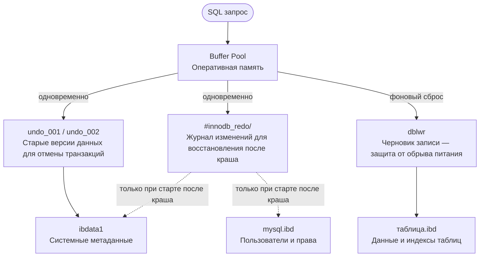

# Разбор инцидента: MySQL падение и восстановление

**Дата инцидента:** 13 мая 2026  
**Сервер:** cash-306-9  
**СУБД:** MySQL 8.0.31 (Ubuntu 22.04)  
**Datadir:** `/linuxcash/cash/data/mysql/`  
**Диск:** Transcend SSD 128GB (TS128GSSD370S)

---

## Симптомы

- MySQL не запускается, циклически падает
- `systemctl status mysql` → `status=2/INVALIDARGUMENT`
- `journalctl -u mysql` — только сообщения об остановке/старте, без деталей
- Сервис перезапускался 10+ раз и уходил в `Start request repeated too quickly`

---

## Хронология

### 7 мая 2026
Первый признак проблемы — MySQL зафиксировал порчу страницы на диске:
```
[ERROR] [MY-011906] [InnoDB] Database page corruption on disk or a failed file read
of page [page id: space=1117, page number=631]
```
**Причина:** внезапное отключение питания (SMART атрибут `Power-Off_Retract_Count: 181`)

### 13 мая 2026
MySQL крашнулся во время выполнения запроса:
```
Query: TRUNCATE TABLE tmc2
```

#### Что такое LSN и почему возник mismatch

MySQL не пишет изменения сразу в основные файлы данных — это медленно. Вместо этого работает механизм **WAL (Write-Ahead Logging)**:

1. Операция сначала записывается в **redo-лог** (быстрая последовательная запись)
2. Страница данных помечается как "грязная" в памяти
3. Фоновый поток постепенно сбрасывает изменения из памяти в основные файлы данных

Каждая операция получает уникальный номер — **LSN (Log Sequence Number)**, монотонно возрастающий счётчик. По нему MySQL понимает в каком порядке применять изменения при восстановлении.

**Что произошло при отключении питания:**

```
Redo-лог:     [LSN: 29040587791]  ← журнал успел записать до сюда
                       ↑
                ПИТАНИЕ ОТКЛЮЧИЛОСЬ
                       
Файлы данных: [LSN: 29057308288]  ← данные УЖЕ были сброшены дальше
```

MySQL успел сбросить изменения из памяти в файлы `undo_001` и `undo_002` **дальше**, чем успел записать в redo-лог. При следующем запуске MySQL сравнил LSN и увидел противоречие:

> "Файлы данных говорят что последняя операция была LSN 29057308288, а мой журнал знает только до 29040587791 — откуда взялись эти изменения? Я их не записывал!"

Это и есть **"LSN in the future"** — файлы данных содержат изменения из "будущего" относительно журнала. MySQL отказывается стартовать, чтобы не применить некорректные данные поверх корректных.

**Почему именно при TRUNCATE:** это тяжёлая операция, которая активно пишет в undo-логи (для возможности отката). В момент пика записи питание и пропало — undo-файлы получили данные, а redo-лог не успел их зафиксировать.

---

## Диагностика

### Шаг 1 — Проверка журнала systemd
```bash
journalctl -xeu mysql
```
Показал только `status=2/INVALIDARGUMENT` — недостаточно для диагноза.

### Шаг 2 — Проверка лога MySQL
```bash
tail -100 /var/log/mysql/error.log
```
Выявил реальную проблему:
```
[ERROR] Tablespace 'innodb_undo_002' Page [...] log sequence number 29057308288
is in the future! Current system log sequence number 29040587791.
```
Сотни таких строк для `innodb_undo_001` и `innodb_undo_002`.

**Вывод:** LSN (Log Sequence Number) в файлах tablespace больше чем в redo-логах. Данные "новее" журнала — типичное следствие краша без нормального shutdown.

### Шаг 3 — Проверка диска
```bash
smartctl -a /dev/sda
dmesg | grep -iE 'error|bad|sector'
```
- SMART: **PASSED**, ошибок нет
- `Uncorrectable_Error_Cnt: 0`
- `Reallocated_Sector_Ct: 0`
- `Remaining_Lifetime_Perc: 82%`
- **`Power-Off_Retract_Count: 181`** — 181 внезапное отключение питания

**Вывод:** диск физически здоров, но сервер систематически обесточивался без корректного завершения MySQL.

---

## Решение

### Попытка 1 — innodb_force_recovery
Добавить в `/etc/mysql/mysql.conf.d/mysqld.cnf`:
```ini
[mysqld]
innodb_force_recovery = 3
```

| Уровень | Результат |
|---------|-----------|
| 1 | не запустился |
| 2 | не запустился |
| 3 | **запустился в read-only режиме** ✓ |

С уровнем 3 MySQL пропускает откат незавершённых транзакций — именно это и блокировало старт.

### Попытка 2 — удаление redo-логов
```bash
mv /linuxcash/cash/data/mysql/#innodb_redo /linuxcash/cash/data/mysql/#innodb_redo_old
mkdir /linuxcash/cash/data/mysql/#innodb_redo
chown mysql:mysql /linuxcash/cash/data/mysql/#innodb_redo
```
Убрали `innodb_force_recovery`, запустили — **не помогло**.

Стектрейс краша указал на проблему в undo-логах:
```
trx_rollback_or_clean_recovered
trx_undo_update_cleanup
trx_purge_add_update_undo_to_history
flst_insert_before → assertion failed
```
MySQL падал при попытке откатить транзакции из повреждённых undo-файлов.

### Решение — удаление undo-логов
```bash
systemctl stop mysql
# убрать innodb_force_recovery из конфига
mv /linuxcash/cash/data/mysql/undo_001 /linuxcash/cash/data/mysql/undo_001.bak
mv /linuxcash/cash/data/mysql/undo_002 /linuxcash/cash/data/mysql/undo_002.bak
systemctl start mysql
```
**MySQL запустился чисто.** Undo-файлы были пересозданы автоматически.

---

## Архитектура InnoDB — как движутся данные



Каждый файл пишется на диск независимо — никакого слияния нет:

- **`таблица.ibd`** — данные и индексы конкретной таблицы. Свой файл у каждой таблицы
- **`ibdata1`** — системные метаданные: список таблиц, активные транзакции, data dictionary
- **`mysql.ibd`** — отдельный файл для системных таблиц MySQL: пользователи, права, процедуры, события

Все три физически лежат на одном диске в одной папке, но это просто разные независимые файлы — MySQL пишет в каждый из них отдельно в зависимости от типа данных.

> **Redo и Undo пишутся одновременно**, не последовательно. Redo — чтобы повторить операцию после краша. Undo — чтобы откатить незавершённую транзакцию. LSN (Log Sequence Number) — монотонный счётчик операций. Если файлы данных содержат LSN выше чем знает redo-лог — MySQL отказывается стартовать ("LSN in the future").

> **Пунктирные стрелки** означают что redo-лог обращается к файлам данных только при старте после краша — не в штатном режиме. В обычной работе данные идут из Buffer Pool напрямую в файлы через фоновый сброс. Redo-лог при этом пишется параллельно как страховка, но в файлы не участвует. Crash recovery срабатывает один раз при запуске: MySQL смотрит в redo-лог, находит операции которые не успели попасть на диск, и применяет их.

---

## Анализ компонентов

| Компонент | Назначение | Воссоздаётся при удалении |
|-----------|-----------|--------------------------|
| `#innodb_redo/` | Redo-логи — журнал всех изменений. При крэше MySQL смотрит сюда и "доигрывает" незавершённые операции | ✅ да |
| `undo_001`, `undo_002` | Undo-логи — хранят старые версии данных для `ROLLBACK` и MVCC | ✅ да |
| `ibdata1` | Системное табличное пространство, метаданные | ❌ нет |
| `mysql.ibd` | Системные таблицы (пользователи, права) | ❌ нет |
| `#ib_16384_*.dblwr` | Doublewrite buffer — черновик записи, защита от обрыва питания | ✅ да |
| `ib_buffer_pool` | Снимок буферного пула для быстрого прогрева после старта | ✅ да |
| `ibtmp1` | Временные таблицы для сортировок и GROUP BY | ✅ да |
| `*.ibd` таблиц | Данные пользовательских таблиц | ❌ нет |

### Что такое MVCC

**MVCC (Multi-Version Concurrency Control)** — механизм позволяющий разным сессиям читать данные одновременно не блокируя друг друга.

```sql
-- Сессия 1: меняет баланс, ещё не закоммитила
BEGIN;
UPDATE счёт SET баланс = 500;

-- Сессия 2: читает в этот момент
SELECT баланс FROM счёт;
-- Видит старое значение из undo-лога, не ждёт сессию 1
```

Undo-логи хранят эти старые версии — поэтому они нужны не только для `ROLLBACK`, но и для MVCC. Именно поэтому их повреждение так критично.

### Что такое фоновый сброс

MySQL не пишет каждое изменение сразу на диск — это медленно. Изменения накапливаются в Buffer Pool в памяти, а фоновый поток периодически сбрасывает их на диск:

```
Запрос → изменение в памяти (Buffer Pool) → быстрый ответ клиенту
                    ↓
          фоновый поток InnoDB
                    ↓
         через какое-то время → сброс на диск
```

Выигрыш в скорости — десятки мелких записей объединяются в одну операцию. Риск — если питание пропало до сброса, данные в памяти теряются. Именно для этого существует redo-лог — он пишется сразу при каждой операции, и при следующем старте MySQL восстанавливает потерянное из него.

---

## Как определить какой компонент сломан

### Главный инструмент — error.log

```bash
tail -100 /var/log/mysql/error.log
```

По тексту ошибки сразу понятен компонент:

| Что в логе | Сломан компонент |
|-----------|-----------------|
| `LSN in the future` для `innodb_undo_*` | undo-логи |
| `LSN in the future` для `mysql` / `tablespace` | redo-лог отстал от данных |
| `Database page corruption` | `.ibd` файл таблицы или `ibdata1` |
| `assertion failed` + стектрейс `trx_undo_*` | undo-логи |
| `Cannot open tablespace` | конкретный `.ibd` файл повреждён или удалён |
| `Table doesn't exist in engine` | `.ibd` есть, но нет в data dictionary |
| `Out of disk space` | `ibtmp1` или `ibdata1` заполнил диск |

### Если MySQL запустился — проверка изнутри

```bash
# Состояние движка — транзакции, блокировки, буферы
mysql -e "SHOW ENGINE INNODB STATUS\G" | less

# Состояние всех tablespace
mysql -e "SELECT SPACE, NAME, STATE FROM information_schema.INNODB_TABLESPACES;"

# Таблицы без физического файла
mysql -e "SELECT * FROM information_schema.INNODB_TABLES
          WHERE SPACE NOT IN (SELECT SPACE FROM information_schema.INNODB_TABLESPACES);"
```

### Если MySQL не запускается — стектрейс в логе

Функции в стектрейсе прямо называют сломанный компонент:

| Префикс функции | Компонент |
|----------------|-----------|
| `trx_undo_*` | undo-логи |
| `buf_page_*` | Buffer Pool / страница данных |
| `fil_*` | файловый слой (`.ibd`) |
| `log_*` | redo-лог |
| `dict_*` | data dictionary |

### Проверка целостности файлов

```bash
# Проверить конкретный файл на corruption
innochecksum /linuxcash/cash/data/mysql/ibdata1
innochecksum /linuxcash/cash/data/mysql/mydb/mytable.ibd
```

---

## Корневая причина

**Систематические внезапные отключения питания** (181 случай за время жизни сервера) без UPS привели к:
1. Порче страницы данных 7 мая
2. Крашу MySQL 13 мая во время записи (`TRUNCATE TABLE tmc2`)
3. Рассинхронизации LSN между tablespace и redo-логами
4. Повреждению undo-логов с незавершёнными транзакциями

---

## Что делать дальше

```bash
# 1. Регулярные бэкапы (добавить в cron)
mysqldump -u root -p --all-databases --single-transaction \
  --skip-lock-tables > /backup/mysql_$(date +%Y%m%d_%H%M).sql

# 2. Включить защиту от partial write
# в mysqld.cnf:
innodb_doublewrite = ON
innodb_flush_method = O_DIRECT

# 3. Очистить старые файлы после проверки данных
rm /linuxcash/cash/data/mysql/undo_001.bak
rm /linuxcash/cash/data/mysql/undo_002.bak
rm -rf /linuxcash/cash/data/mysql/#innodb_redo_old
```

- Установить **UPS** или проверить существующий
- Настроить мониторинг MySQL (например через Prometheus + mysqld_exporter)
- Настроить алерты на ошибки в `/var/log/mysql/error.log`

---

## Итог

Инцидент решён без потери данных и без переинициализации БД. MySQL работает в штатном режиме.

**Время восстановления:** ~2 часа  
**Потеря данных:** незавершённые транзакции на момент краша (TRUNCATE TABLE tmc2)
